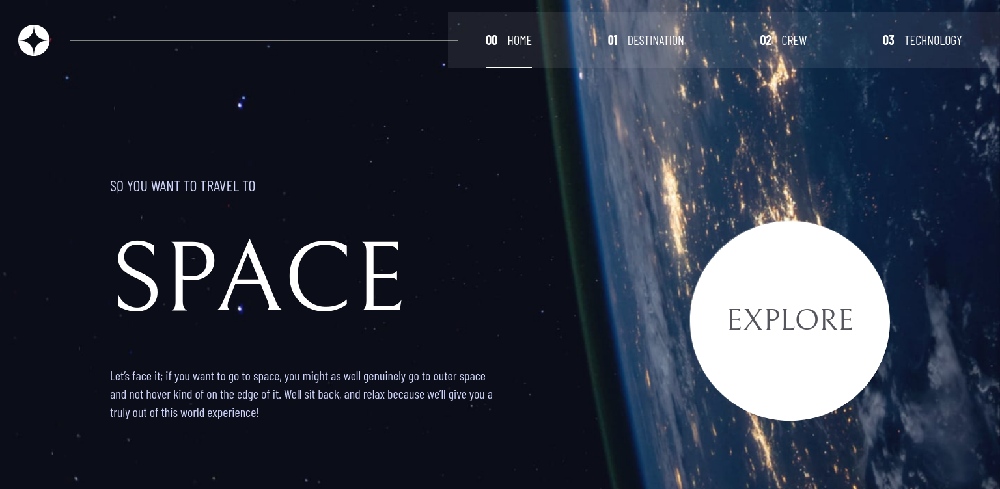
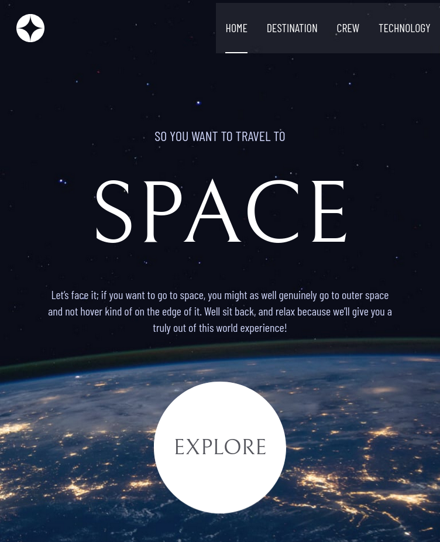
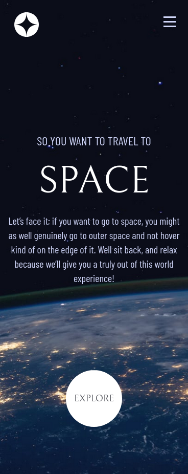

# Frontend Mentor - Space tourism website solution

This is a solution to the [Space tourism website challenge on Frontend Mentor](https://www.frontendmentor.io/challenges/space-tourism-multipage-website-gRWj1URZ3). Frontend Mentor challenges help you improve your coding skills by building realistic projects.

## Table of contents

- [Overview](#overview)
    - [The challenge](#the-challenge)
    - [Screenshot](#screenshot)
    - [Links](#links)
- [My process](#my-process)
    - [Built with](#built-with)
    - [What I learned](#what-i-learned)
    - [Continued development](#continued-development)
    - [Useful resources](#useful-resources)
- [Author](#author)

## Overview

### The challenge

Users should be able to:

- View the optimal layout for each of the website's pages depending on their device's screen size
- See hover states for all interactive elements on the page
- View each page and be able to toggle between the tabs to see new information

### Screenshot
-Desktop screenshot

-Tablet screenshot

-Mobile screenshot

### Links

- Solution URL: [GitHub repository](https://github.com/Subashkumar-S/space-tourism-website)
- Live Site URL: [Space Tourism website](https://space-tourism-website-f037b.web.app/)

## My process

### Built with

- Semantic HTML5 markup
- Tailwind CSS
- Flexbox
- CSS Grid
- Mobile-first workflow
- [React](https://reactjs.org/) - JS library

### What I learned
I have learned and practice ReactJs and Tailwind CSS by building this project.

### Continued development

To practice ReactJs more helps me to continue focusing on in future projects.
### Useful resources

- [Tailwind CSS Documentation](https://tailwindcss.com/docs/installation) - This helped me integrate Tailwind CSS in react app and identify CSS properties to be used.
- [React Documentation](https://react.dev/learn) - This article helps me to create react app and nest components. I also learned render components response to events.
-[ReactJs Router](https://www.geeksforgeeks.org/reactjs-router/) - This article helps to understand React Router and components to create navbar and route between pages.

## Author

- Frontend Mentor - [@Subashkumar-S](https://www.frontendmentor.io/profile/Subashkumar-S)

